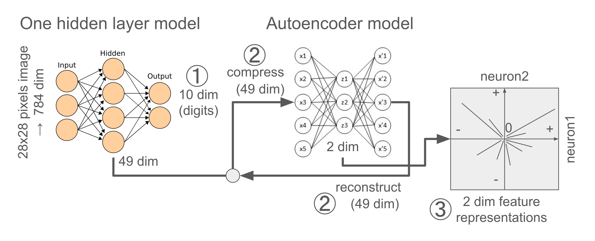

# Welcome to my AI safety project

 

<em><strong>TL;DR:</strong> 
My project replicates key findings from Anthropic's Toy Model (Elhage et al., 2022) 
and the Sparse Autoencoder (Bricken et al., 2023) 
using a single-layer linear model with ReLU filtering, 
trained on the MNIST dataset (Exp1-2). 
Building on this, 
I introduce a novel interpretability technique 
designed to make the model’s internal representations 
more transparent and human-understandable (Exp3). 
Code is provided for each experiment. 
You can skip directly to the project summary [here](#proj-sum).</em>

 

<h2> About my AI safety project </h2>

 

<b>Participation Overview</b>

From October 2024 to February 2025, I participated in the AI Safety Fundamentals (AISF) program, organised by the BlueDot Impact. I specifically took part in the Alignment course (https://aisafetyfundamentals.com/alignment/), which was structured into two phases:  

1. <b>Learning Phase (8 weeks)</b>: This phase provided foundational knowledge on AI safety topics such as AI risks and misalignment, reinforcement learning from human feedback (RLHF), scalable oversight, AI model robustness, mechanistic interpretability, and model risk/capability evaluations. It helped in formulating research questions and deeply engaging with the field.
2. <b>Project Phase (4 weeks)</b>: This phase allowed participants to explore their own research questions. I conducted three experiments over three weeks and spent two weeks writing my findings, dedicating approximately 4-6 hours per week.

<b>Project Goals and Execution</b>

My initial goal was to create an interactive project—similar to previous AISF projects [like this](https://swe-to-mle.pages.dev/posts/deck-of-many-prompts-jailbreaking-llms-for-fun-and-profit/) or engaging educational content like [this YouTube clip](https://www.youtube.com/watch?v=1xB2ooTa3yE&t=17s)—to make AI safety concepts more accessible. However, due to time constraints, I shifted my focus to a more practical and reproducible approach.

Instead, I developed a project that replicates key findings from Anthropic’s work using toy models and real image datasets. The provided code allows visitors to implement experiments themselves, fostering hands-on learning. Additionally, I ensured that all experiments run on standard personal computers (2024 PC/laptop) without requiring cloud computing or GPUs, making them accessible to a broader audience.

<b>Encouraging Hands-on Learning</b>

While my experiments are still in a draft stage and may have areas for improvement, I encourage visitors to engage actively by:
- Running the provided code
- Experimenting with different settings
- Exploring alternative research questions and modified implementations

This approach aims to help new AI safety researchers, engineers, and practitioners gain practical experience in a specific AI safety topic—particularly superposition analysis. My project is designed as a self-guided starting point for running AI safety experiments.

Of course, there is no problem to just read my project summary to get a high-level overview of my project's findings and think through future directions or wider applications. Feel free to explore as you wish!

<b>Accessibility and Engagement</b>

I welcome feedback, insights, and ideas to improve or expand this work. Feel free to reach out!

Contacts  
X/Twitter: https://x.com/htsujimura  
Bluesky: https://bsky.app/profile/htsujimura.bsky.social  
Linkedin: https://www.linkedin.com/in/hikaru-tsujimura/  

 

<h2 id="proj-sum"> Project summary </h2>

 

<h3 id="intro"> Introduction </h3>

 <b>For non-technical readers, click and read hidden texts here for background information on the Mechanistic Interpretability (Mech Interp) method</b> 

 

<b>Overview of Previous AI Safety Research</b>

The 2020s have marked a turning point in our awareness of AI risks, 
particularly as AI systems rapidly expand their capabilities, 
potentially replacing human labor across numerous fields 
([see an overview of concerned AI risks on my linkedin post](https://www.linkedin.com/posts/hikaru-tsujimura_ai-aiabrrisk-aiabrthreat-activity-7256778739252916224-RfI3?utm_source=share&utm_medium=member_desktop)).
Researchers have increasingly identified concerning behaviors 
in state-of-the-art (SOTA) AI systems, 
such as deception, 
power-seeking tendencies, 
and the ability to hide true intentions. 
If AI continues advancing unchecked, 
particularly with opaque internal processes and misaligned goals, 
it could pose significant existential threats to humanity.

To address these risks and improve transparency in AI decision-making, 
<b>Mechanistic Interpretability</b> <b>(Mech Interp)</b> 
has emerged as a groundbreaking approach (Olah et al., 2020). 
The primary goal of Mech Interp is 
to decompose complex neural activities into interpretable components, 
making it easier to predict AI behavior and mitigate potential risks.

A fundamental concept in Mech Interp is the identification of <b>features</b>, 
which function like elements in the periodic table, 
representing distinct interpretable information. 
Groups of features form <b>circuits</b>, 
similar to chemical compounds, encoding more complex patterns. 
A key claim of Mech Interp is that these neural structures exhibit <b>universality</b>, 
meaning similar patterns exist across different models, 
enabling efficient reuse of learned representations.

However, two challenges hinder interpretability:
1. <b>Polysemanticity</b>: A single neuron can encode multiple unrelated features, making it difficult to map neurons to specific concepts.
2. <b>Superposition</b>: More features can be represented than there are neurons available by encoding multiple features in a compressed manner (Elhage et al., 2022). Superposition occurs when features are sparsely represented, allowing efficient but entangled storage of information.

To overcome these challenges, 
researchers have developed <b>Sparse Autoencoders</b> (Bricken et al., 2023), 
a technique designed to disentangle polysemantic and 
superposed representations into <b>monosemantic</b> ones—where 
a single neuron corresponds to a single feature, enhancing interpretability.

 

<b>Research Objectives</b>

Anthropic's previous work (Elhage et al., 2022) 
demonstrated superposition in toy models, 
showing that features outnumber neurons 
when sparsity is high. 
However, their experiments used synthetic, 
well-defined feature distributions with limited diversity 
(3–20 features, with one experiment extending to 80). 
In real-world applications, 
data is often noisy and lacks predefined feature distributions, 
making replication and extension of these findings challenging.

This project aimed to replicate and extend Anthropic’s findings 
using the MNIST handwritten digit dataset, 
a real-world image dataset, 
to test whether superposition effects persist in practical applications.

Specifically, I conducted three experiments (Exp1-3):
- <b>Exp1</b>: Tested whether superposition does not occur when feature sparsity is zero (dense representation).
- <b>Exp2</b>: Tested whether superposition occurs at high sparsity levels (e.g., 0.999).
- <b>Exp3</b>: Used Sparse Autoencoders to extract features from MNIST images and assessed whether these features could be converted into human-interpretable visual representations using a generative model.

 

<h3 id="exp1"> Exp1 </h3>

The Exp1 aimed 
to verify a claim from Elhage et al., (2022) 
that superposition does not occur 
when feature sparsity is zero—meaning 
the number of features should match the number of neurons. 

<b>Methodology</b>

- Implemented a simple linear model with one hidden layer (49 neurons) and ReLU filtering, trained on MNIST dataset for digit classification.
- Trained a classic autoencoder to map the 49-dimensional representations into a 2D latent space, testing whether only two primary features remained.
- Measured feature importance, defined as the contribution of each feature to the autoencoder’s mean squared error (MSE) loss to reconstruct the 49-dimensional neural representations of the linear model.
- The measured feature importance was expressed as the line length of each feature on the 2 dim feature representation map.

See <b>Diagram 1</b> for visual summary of this experiment. For further details of Exp1, check [here](nb/notebook1.ipynb).

 

<b>Diagram 1:</b> Visual summary of Exp1. This diagram is mainly for depicting the two model architectures and experiment designs (①-③) used in Exp1. 
Please ignore a number of neurons (circles), which are not correct.
① At first, the one-hidden layer linear model with ReLU filtering trained to predict 0-9 digit classes with inputs of 28x28 pixel images. 
② After trained the main linear model, an autoencoder model was trained with the trained 49 hidden layer neural activations to reconstruct the original 49 neural activations, bypassing through the smaller hidden layer (2 dim).
③ After trained the autoencoder model, the same digit images were inputed into the main linear model, activating the 49 hidden layer neurons of the linear main model, which in turn activated the 2 hidden layer neurons of the autoencoder model, finally drawing the 49 feature representations in 2 dim.

 

<b>Results</b>

- The 49 features gradually aligned into two major feature directions over 20 training epochs.
- When normalized between -1 and 1, the two of relatively important features were orthogonal, while relatively less important features remained closer to zero.
- Some features with high importance appeared between the two primary directions, suggesting partial redundancy or shared information.

See <b>Figure 1</b> for visual summary of Exp1 result.

 

<b>Figure 1:</b> Visual summary of Exp1 results.
These line graphs were 49 features/neurons represented in 2 dim of the autoencoder hidden layer across 20 training epochs.
The length of features is a degree of importance, indicating how much a feature contributes to the MSE loss of the autoencoder model to reconstruct the 49 neural activations of the lienar model. The more contribution, the larger importance value. 
The horizontal- vertical-coordinates of features were expressed by the 2 neurons of the autoencoder hidden layer, and normalized them into -1 to 1 range.

 

Codes, more results and detailed research settings are available [here](nb/notebook1.ipynb).

 

<h3 id="exp2"> Exp2 </h3>

After successfully replicating the results in Experiment 1 (Exp1), 
which showed no superposition in a toy model with dense features, 
Experiment 2 (Exp2) tested 
whether superposition would emerge 
when the feature distribution was highly sparse (sparsity level = 0.999).

<b>Methodology</b>

Exp2 followed the same experimental design as Exp1, 
with one key difference: 
a sparsity penalty was applied during data transformation. 
Specifically, the transformation 
from the 49 dim neural representations of the linear model to 
the 2 dim neural representations of the autoencoder 
included a constraint to maintain feature sparsity. 
See <b>Diagram 2</b> for visual summary of this experiment. 
For further details of Exp2, check [here](nb/notebook2.ipynb).

 

<b>Diagram 2:</b> Visual summary of Exp1. 
Experiment design of Exp2 was exactly same as the Exp1, 
except a condition in which 
sparsity penalty was applied to the data transformation 
from the 49 dim neural representations to the 2 dim neural representations. 

 

<b>Results</b>

By making this adjustment, 
I successfully replicated superposition in the linear model 
with highly sparse features. 
The 49 dim neural representations were mapped onto 
multiple feature directions within the 2 dim autoencoder's hidden layer neurons. 
However, the exact nature of these feature representations—whether 
they were orthogonal, antipodal, pentagonal, 
or followed a more complex geometric structure—remains unclear.

This finding suggests a potential avenue for future research: 
investigating the development of feature geometry in more complex datasets, 
such as MNIST. 

See <b>Figure 2</b> for visual summary of Exp2 result.

 

<b>Figure 2:</b> Visual summary of Exp2 results.
Compared to Exp1 result, here showed superposition of the linear model, representing multiple feature direcitons in the autoencoder model by making features sparse.

 

Codes, more results and detailed research settings are available [here](nb/notebook2.ipynb).

 

<h3 id="exp3"> Exp3 </h3>

Building on the successful replications of the Anthropic's previous work in Exp1 and Exp2—
demonstrating superposition in a single-layer linear model trained on the MNIST digit dataset—
<b>Exp3</b> explored further 
whether the image data-driven superposed expressions in the lienar model 
would be applicable for improving interpretability 
and transparency of neural representations of extracted features.

Specifically, 
important features identified
in the sparse autoencoder (SAE) model has been used 
for "steering", 
a technique to amplifying selective features, 
enforcing models to output the steered features more frequently in language models 
(e.g. [Anthropic's Golden Gate Bridge case, 2024](https://www.anthropic.com/news/mapping-mind-language-model)). 
Extending from the steering technique in the language models, 
Exp3 applies steering to a sparse autoencoder (SAE) trained on MNIST digit representations 
to determine whether activating specific features 
can reconstruct digit-like images, 
thereby highlighting their role in image representation.
See <b>Diagram 3</b> for visual summary of this experiment. 
For further details of Exp3, check [here](nb/notebook3.ipynb).

<b>Methodology</b>

Model Architecture and Experiment Design
1. Baseline Models (Steps ①-②):
   - A one-layer linear model is trained on MNIST images.
   - An SAE model is trained to reconstruct the 49 dim hidden layer activations of the linear model, using a 98 dim hidden layer.
2. Image Reconstruction (Steps ③-➃):
   - An image generative model or a decoder is trained to reconstruct 28×28 images from the 49-dimensional hidden activations of the linear model.
3. Feature Steering (Steps ➄-➅):
   - After training, only select neurons in the SAE model (e.g., the neuron corresponding to "feature 1" for digit 9) are activated, while others are set to zero.
   - The resulting activations reconstruct the 49 dim hidden layer of the linear model, which is then used to regenerate the 28×28 digit-like images through the image generative model.

 

<b>Diagram 3:</b> Visual summary of Exp3. This diagram is mainly for depicting the three model architectures and experiment designs (①-➅) used in Exp3. 
Please ignore a number of neurons (circles) on the graph, which are not correct. 
①-② followed the same procedures as Exp1 and 2, except that the sparse autoencoder model has 98 dim neurons in its hidden layer. Briefly, the one-layer linear model trained with the MNIST image datasets and the Sparse autoencoder (SAE) model trained with the trained 49 hidden layer neural activations of the linear model to reconstruct the original 49 neural activations, bypassing through the larger hidden layer (98 dim).
③-➃ An image generative model (or a decoder) trained with the trained 49 hidden layer neural activations of the linear model to reconstruct the original 784 dim of flattened images.
➄-➅ After trained the SAE model, only activating selective n/98 hidden layer neurons (e.g. feature1 important for digit 9) of the SAE model and set other neuron activation to 0, which in turn reconstructing the 49 neural activations of the linear model, which in turn reconstructing 784 dim of flattened images by the image Generative model.

 

<b>Results</b>

Exp3 produced promising preliminary findings:
- <b>Feature Contribution</b>: Activation histograms (or Feat histogram) showed that only a few (2–5 out of 98) SAE features strongly influenced the mean squared error (MSE) loss when reconstructing the 49 dim hidden layer of the linear model for each digit.
- <b>Unsupervised Digit Reconstruction</b>: Selectively activating key features led to unsupervised reconstruction of digit-like images without direct supervision, demonstrating the interpretability of the features in a human-understandable manner.

See <b>Figure 3</b> for visual summary of Exp3 result.

 

<b>Figure 3:</b> Visual summary of Exp3 results.
The left column showed a collection of histograms of 98 feature activations with two vertical border lines (orange dashed line for the 90th percentile and black dashed line for expected probability = 1/98). The activation level was normalized so that a sum of all activation level was 1. This histogram showed the results when the SAE model sparsity level = 0.999.
The middle column provided an example visual aids demonstrating how each digit class activated selective neurons/features important for each digit class (and deactivated non-important features), which reconstructed the 49 dim hidden layer of the linear model.
The right column drew how the selective features important for each digit class generated each digit class-like 28x28 image with the image generative model.

 

Codes, more results and detailed research settings are available [here](nb/notebook3.ipynb).

 

<h3 id="exp3"> Final conclusion and future direction </h3>

Exp 1 and 2 successfully replicated the superposition phenomenon in toy models—specifically, a single-layer linear model with ReLU filtering—using the MNIST handwritten digit dataset. This confirms that even simple linear models exhibit superposition when trained on raw image data. These results suggest further investigation into whether larger models, more complex datasets, or more diverse image domains also exhibit similar behavior.

A key novel finding from Exp 3 is that interpretability can be enhanced using a combination of three models:
- A <b>main model</b> performing the primary task.
- A <b>sparse autoencoder (SAE)</b> extracting more mono-semantic-like features.
- A <b>generative model</b> reconstructing inputs from the hidden layers of the main model.

By selectively activating key features, this approach enables the reconstruction of dataset-like stimuli, potentially improving human interpretability. Future work could explore applying this combined technique across different tasks, domains, and objectives by adapting each component to the most relevant architecture or model type.

 

<h3 id="ref"> References </h3>

- Elhage, N., Hume, T., Olsson, C., Schiefer, N., Henighan, T., Kravec, S., ... & Olah, C. (2022). Toy models of superposition. arXiv preprint arXiv:2209.10652.
- Bricken, T., Templeton, A., Batson, J., Chen, B., Jermyn, A., Conerly, T., ... & Olah, C. (2023). Towards monosemanticity: Decomposing language models with dictionary learning. Transformer Circuits Thread, 2.
- Templeton, A., Conerly, T., Marcus, J., Lindsey, J., Bricken, T., Chen, B., ... & Henighan, T. (2024). Scaling monosemanticity: Extracting interpretable features from claude 3 sonnet. Transformer Circuits Thread.
